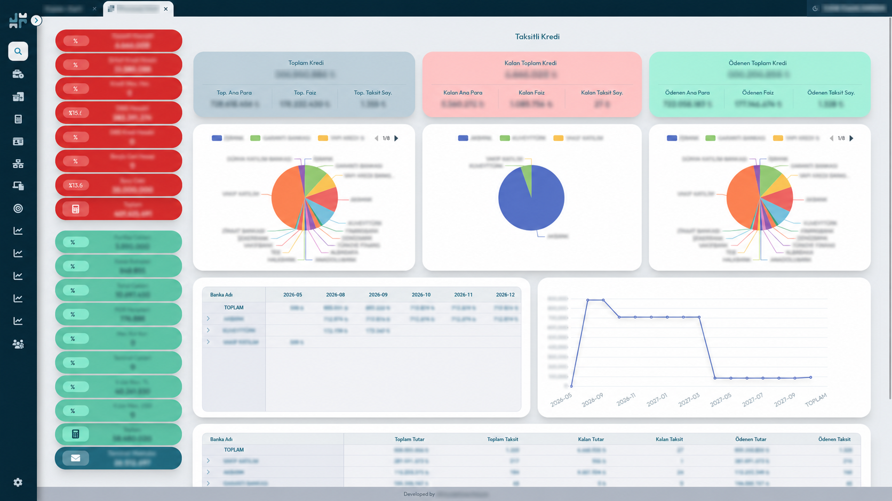
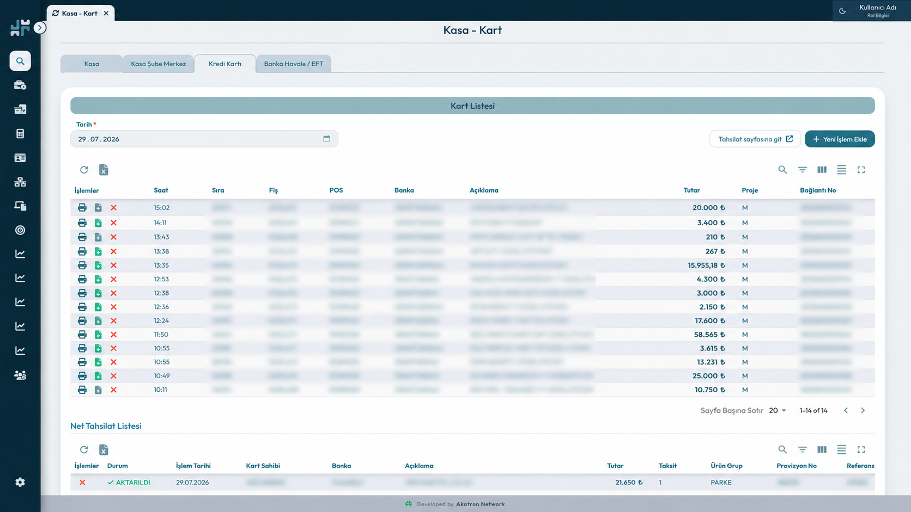
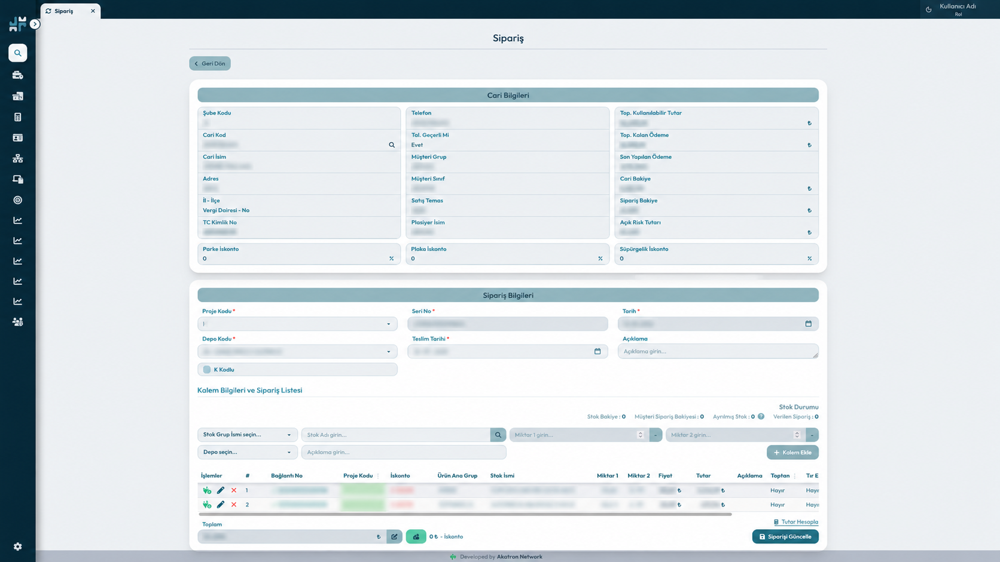
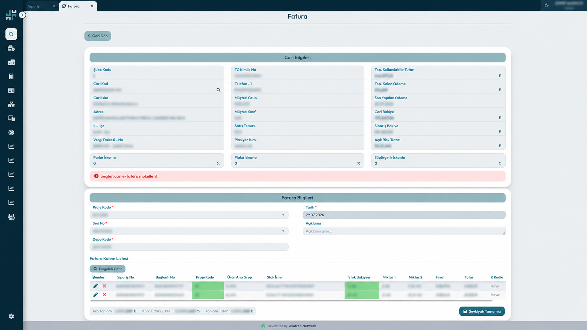
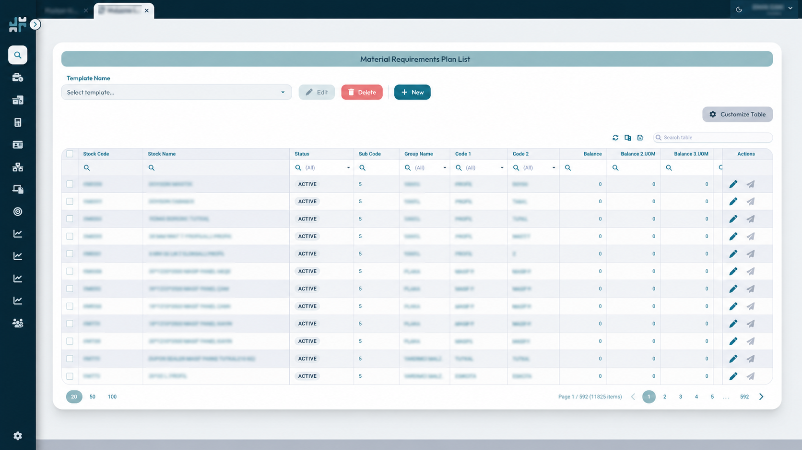

# Seymen Parke Management Platform — Frontend Case Study

Seymen Parke Management Platform is a production ERP-style business application used by approximately 50 employees for daily operational workflows.

This repository presents a high-level case study of my frontend work on the platform. The production source code is private and is not included.

> The screenshots in this repository have been anonymized. Customer details, business identifiers, financial figures, document numbers, and other sensitive data have been obscured.

## Product Preview

### Financial Analysis Dashboard

A reporting interface that brings credit, payment, balance, installment, and bank-based data together through KPI cards, charts, and summary tables.

---

### Cash and Card Operations

A financial operations screen for tracking card transactions, collections, bank activity, references, and related records.

---

### Order Management Flow

A multi-section order workflow combining customer information, balances, delivery details, stock selection, line items, discounts, and calculated totals.

---

### Invoice Management Flow

An invoice workflow that connects customer data, document details, source orders, stock balances, tax calculations, and shipment completion.

---

### Material Planning and Inventory

A data-heavy planning interface with filtering, searching, pagination, configurable columns, and operational actions for large inventory datasets.

## My Role

**Frontend Engineer**

I designed and developed the UI/UX and responsive frontend of the platform from scratch while collaborating with a backend developer responsible for the API and server-side systems.

My responsibilities included:

- UI/UX design and interface planning
- Responsive frontend development
- API integration and frontend data flows
- Complex forms and multi-step business workflows
- Data tables, filters, sorting, and pagination
- KPI cards, charts, and reporting interfaces
- Document-oriented screens and printable outputs
- Performance improvements
- Maintenance, debugging, and production support

## Business Workflows

The platform supports business processes such as:

- Order management
- Invoice workflows
- Inventory and stock operations
- Material requirements planning
- Cash, card, and collection operations
- Finance-related processes
- KPI dashboards and reporting
- Document and output workflows
- Internal management operations

## Frontend Engineering Highlights

### Data-Heavy Enterprise Interfaces

The platform contains large operational datasets that require search, filtering, sorting, pagination, configurable columns, and clear action patterns without overwhelming users.

### Complex Forms and Product Flows

Order and invoice screens combine customer information, balances, dates, warehouse data, stock selection, discounts, line items, totals, and validation in structured workflows.

### Reporting and Visualization

Financial and operational data is presented through KPI cards, charts, summary tables, and pivot-style reporting interfaces designed for daily decision-making.

### Long-Term Production Ownership

The application has been actively used in production for approximately three years. During this period, I worked on new requirements, bug investigation, usability improvements, performance work, and production support based on real user feedback.

## Technical Stack

- React
- Tailwind CSS
- TanStack Query
- Material React Table
- ECharts
- REST APIs

## Collaboration

I worked closely with the backend developer to align API contracts, business rules, and frontend requirements. My ownership was focused on UI/UX, frontend implementation, responsive behavior, API consumption, and production-facing user experience.

## Source Code and Privacy

The production repositories are private because the platform was developed for a client.

This repository contains:

- No production source code
- No credentials or internal API details
- No customer records
- No private business documents
- No unmodified production data

The screenshots are included only to demonstrate interface complexity, workflow design, and frontend responsibilities.
